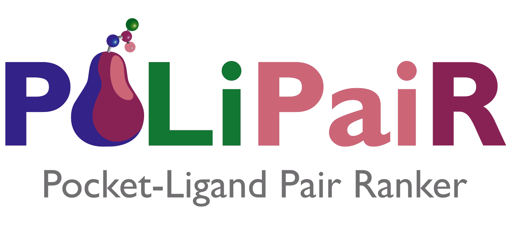
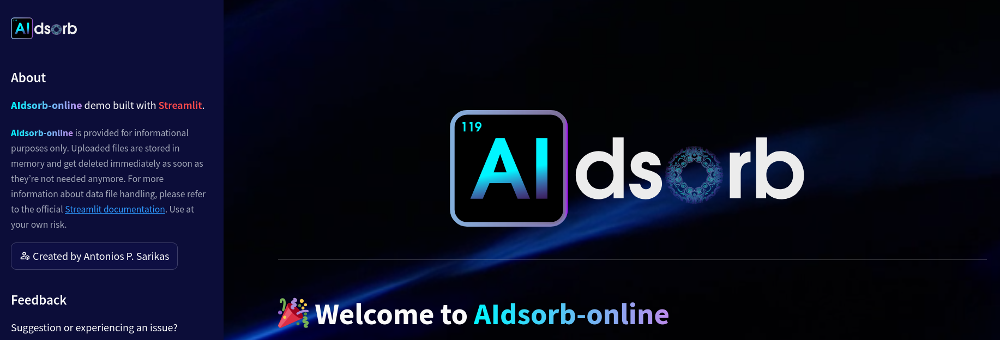

## 💎 AIdsorb: Python package for deep learning on porous materials

<h4 align="center">
  
</h4>

* 🏠 [Homepage](https://github.com/adosar/aidsorb)
* 📚 [Documentation](https://aidsorb.readthedocs.io/en/stable/)
* ✨ [AIdsorb-online](https://aidsorb-online.streamlit.app/)

## 💎 MOXελ: Python package for parallel calculation of energy voxels

<h4 align="center">
  
</h4>

* 🏠 [Homepage](https://github.com/adosar/moxel)
* 📚 [Documentation](https://moxel.readthedocs.io/en/stable/)

## 💎 PoLiPaiR: Evaluating pocket-ligand fitness via machine learning

<h4 align="center">
  
</h4>

* 🚀 [Open the app](https://polipair-demo.streamlit.app/)

## 💎 AIdsorb-online: Evaluating porous materials via deep learning

<h4 align="center">
  
</h4>

* 🚀 [Open the app](https://aidsorb-online.streamlit.app/)
