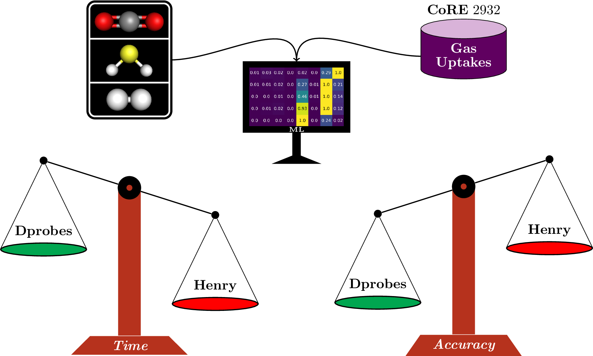

For a full list of publications please refer to my 🎓 [Google Scholar][scholar] profile.

## 📜 [IntelliPore: A Foundation Model for Gas Adsorption in Porous Materials (preprint)][intellipore_paper]

Introduced [IntelliPore][intellipore], a foundation model pretrained at scale on energy images and adsorption-related data across multiple tasks and domains, enabling transfer learning across porous materials and gas adsorption properties.

  

## 📜 [RetNeXt: A Pretrained Model for Transfer Learning Across the MOF Adsorption Space][retnext_paper]

Introduced a multi-task pretraining approach for learning transferable representations across the MOF adsorption space and developed [RetNeXt][retnext], a 3D convolutional neural network that leverages energy images for transfer learning across gas adsorption properties.

  

## 📜 [Gas adsorption meets geometric deep learning: points, set and match][aidsorb_paper]

Proposed a point cloud representation of porous materials and developed [AIdsorb][aidsorb], a geometric deep learning framework for learning gas adsorption properties directly from the raw 3D structure.

  

## 📜 [Gas adsorption meets deep learning: voxelizing the potential energy surface of metal-organic frameworks][retnet_paper]

Proposed a 3D representation for porous materials obtained by voxelizing the potential-energy surface, and developed [RetNet][retnet], a 3D convolutional neural network for learning gas adsorption properties directly from energy images.

  

## 📜 [Comparison of machine learning approaches for the identification of top-performing materials for hydrogen storage][sc]

Benchmarked machine learning approaches for efficiently screening MOFs and identifying high-performing materials for hydrogen storage.

  

## 📜 [Comparison of Energy-Based Machine Learning Descriptors for Gas Adsorption][descriptors]

Benchmarked energy-based descriptors for machine learning prediction of gas adsorption across different gases and MOFs.

  

[scholar]: https://scholar.google.com/citations?view_op=list_works&hl=en&authuser=1&hl=en&user=Zv2Uk0AAAAAJ&authuser=1&scilu=&scisig=AOScLA0AAAAAZTZOq_UhR11DllEgGMnBJdJ2rLw&gmla=AJ1KiT0f5uPOfsFiMcEy9LtOu3Sk-24gDUzLOAQIzjA29mA-yH1xbDz4du7yoiQObS41EU_cNCWpSKLwnFq5xLzrC9Pp1kFSJxx2mFQ&sciund=14498684564743431950
[sc]: https://www.sciencedirect.com/science/article/pii/S2949839223000561
[descriptors]: https://pubs.acs.org/doi/full/10.1021/acs.jpcc.3c04223
[retnet_paper]: https://www.nature.com/articles/s41598-023-50309-8
[retnet]: https://github.com/adosar/retnet
[aidsorb_paper]: https://www.nature.com/articles/s41598-024-76319-8
[aidsorb]: https://github.com/adosar/aidsorb
[retnext_paper]: https://pubs.acs.org/doi/10.1021/acs.jcim.5c02698
[retnext]: https://github.com/adosar/retnext
[intellipore]: https://github.com/adosar/intellipore-paper
[intellipore_paper]: https://chemrxiv.org/doi/full/10.26434/chemrxiv.15008693/v1
